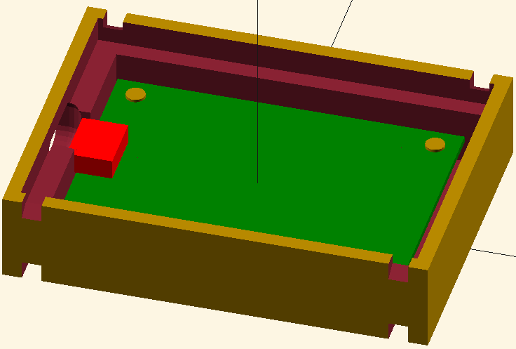
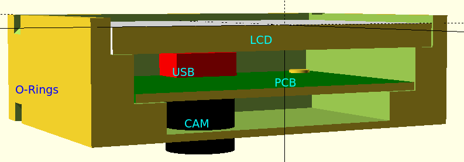

# lichee_dan_case
A minimalistic 3D printable case for the [Sipeed M1 Dan Dock](http://dan.lichee.pro/) eval board.

Just to keep the LCD in place and its flex PCB from breaking.

Outside view. Use rubber o-rings to keep the display in place (which is also the lid).

Cross section view, showing how the PCB sits inside.

__Work in progress__
