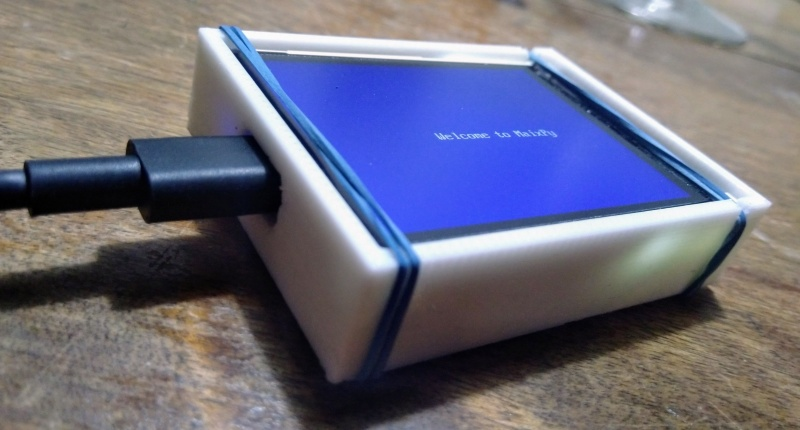

# lichee_dan_case
A minimalistic 3D printable case for the [Sipeed M1 Dan Dock](http://dan.lichee.pro/) eval board.

Keeps the LCD in place and its flex-PCB from breaking.

The display is also the lid of the box, use rubber rings to keep it closed.

Cross sectional view, showing how the PCB sits inside.

## Status
Fabricated it on a Cetus 3D printer with 0.2 mm layer height.
After 3 iterations everything finally fits now as it should :relieved:.
